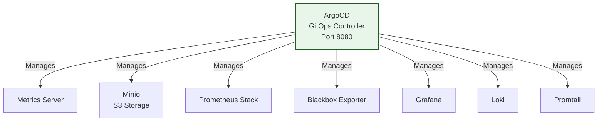
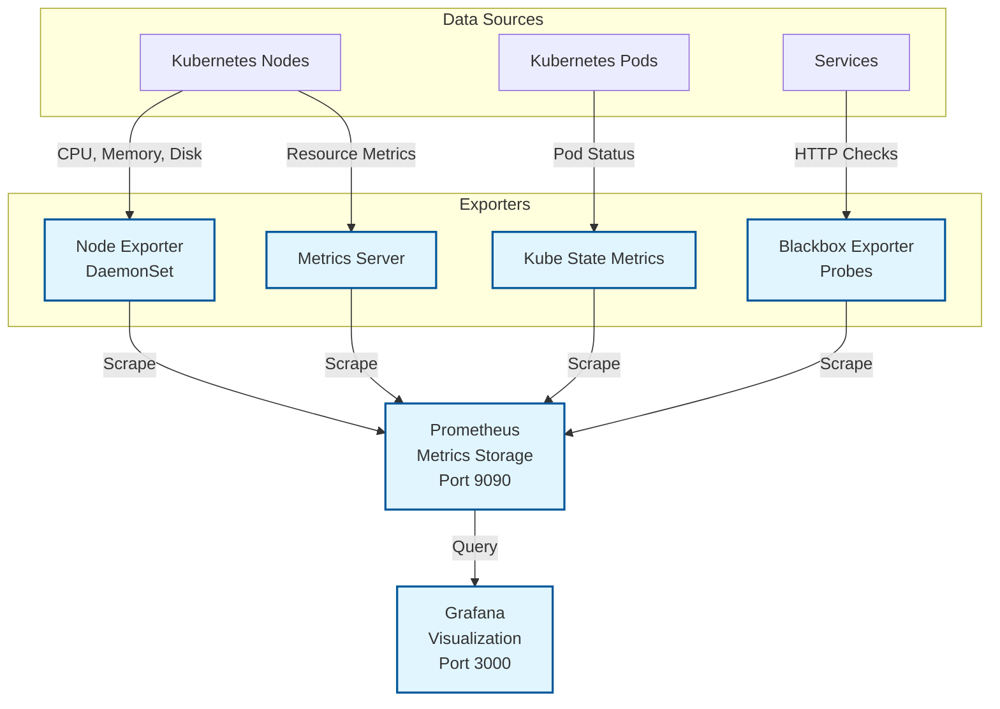
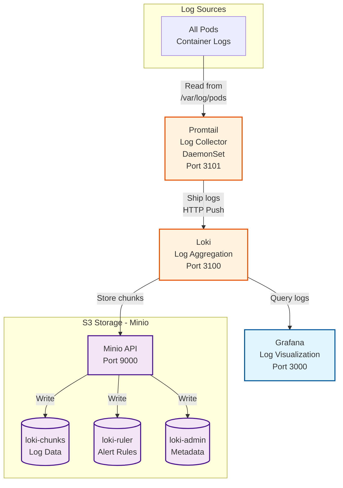

# K8s GitOps Lab Architecture

Note: Arrows are in the direction of data flow or management.

## 1. GitOps Management (ArgoCD)

## 2. Metrics Monitoring (Prometheus & Grafana)

## 3. Logs Monitoring (Loki, Promtail & Grafana)

