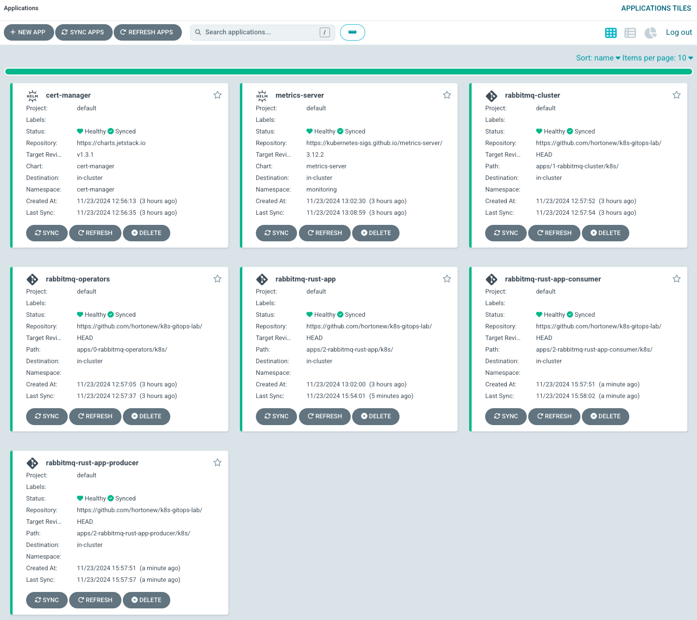
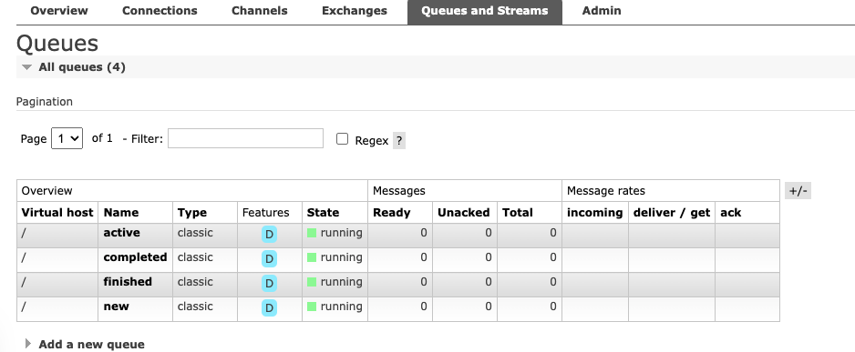

# K8s gitops lab

An environment to play around with different gitops tools.

## Setup

```sh
just setup
```

## Port Forward

Note: Setup does this automatically now and waits for services to be ready.

```sh
just port-forward
# navigate to applications: 
#   Grafana UI: http://localhost:3000
#   Prometheus UI: http://localhost:9090
#   ArgoCD UI: http://localhost:8080
#   Minio API: http://localhost:9000
#   Minio Console: http://localhost:9001
```

## Teardown

```sh
just destroy
```

## Kind

```sh
kind create cluster --name gitops --config kind_config.yml
```

## ArgoCD



```sh
# Install
helm upgrade --install argo-cd bitnami/argo-cd --create-namespace -n argocd -f helm/values/argocd.yml
k get secrets argocd-secret -n argocd -o yaml | grep clearPassword | awk '{print $2}' | base64 -d

# GUI
k port-forward svc/argo-cd-server -n argocd 8081:80
```



### Metallb

Start to build out ingress controllers (nginx/traefik), but first we need some IPs.

```sh
k apply -f argocd-apps/5-metallb/
```

### Traefik Ingress

```sh
k apply -f argocd-apps/6-ingress-controller-traefik/
```

### Nginx Ingress

```sh
k apply -f argocd-apps/6-ingress-controller-nginx
```
